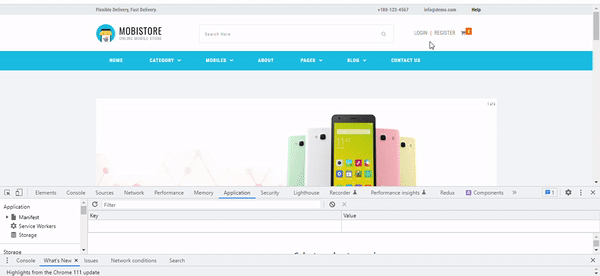
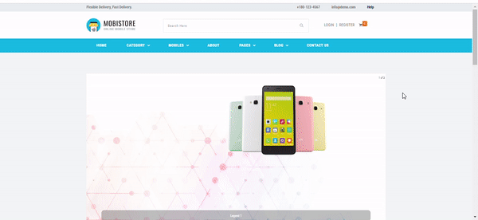
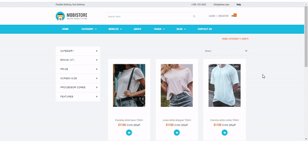

# Getting Started with Create React App

<strong>
I used the tools "React, React-Router-Dom, React-Redux, Redux, Axios, Redux-Toolkit" while developing small parts of this basic shopping site.
</strong>

  Bu temel düzey alışveriş sitesinin küçük bölümlerini geliştirirken "React, React-Router-Dom, React-Redux, Redux, Axios, Redux-Toolkit" araçlarını kullandım.

<strong>
I first performed the login process using the "https://ecommerce-api.udemig.dev/api/v2/docs.html" backend site.
I made my transactions easier by keeping the token information that comes with the login process in localstorage.
</strong>
 

"https://ecommerce-api.udemig.dev/api/v2/docs.html" backend sitesini kullanarak öncelikle login işlemi gerçekleştirdim.
Login işlemiyle gelen token bilgisini localstorage^da tutarak işlemlerimi kolaylaştırdım.

 

 
<strong>
I printed the data from the backend to the screen. and I divided the categories into sections. The Components structure and the map function made my work easier here.
</strong>
 

Backend'den gelen verileri ekrana yazdırdım. ve kategorileri bölümlere ayırdım. Components yapısı ile map fonksiyonu burada işlerimi kolaylaştırdı.

 

Kategori sayfasından aldığım ürünleri sepet sayfasına yönlendirdim. Sepet sayfasının ürün bilgilerini güncellemek, hesaplamaları doğru yapabilmek için yine backend'den gelen verileri javascript ile düzenleyerek kullandım.

 

